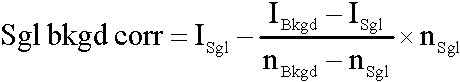

# Manual Tracking
This ImageJ plugin is aimed at tracking simple object, in 2D and/or 3D.

  

## How to install it ?

1. Download the Manual_Tracking.class file from the [release section](https://github.com/fabricecordelieres/IJ-Manual_Tracking/releases).
2. Drag-and-drop the file to the ImageJ's toolbar. When asked, save the file to the proposed folder.

## How to start tracking ?

  

1.	Launch the Manual Tracking plugin. Figure 1 presents the window that should pop up:
2.	Set the xy and z calibration values as well as the time interval value in the appropriate option boxes.
3.	Open the temporal stack using the file/open menu in Image J. Please note that if you plan to “Retrieve z coordinates”, each slice representing a 3D projection must be labelled with the name of the original 3D stack. This could be achieved using the nd stack builder plugin.
4.	To start a new track, click on “Add track”. This action will turn on the tracking mode. Note that the parameters are now hidden. To show parameters, tick the “Show parameters ?” option .
5.	To record xy coordinates of a structure of interest, simply click on it on the image window. The results table will pop up, showing recorded xy coordinates, as well as the distance travelled by the structure during the time interval between two successive images, and velocity of movement. The intensity of the corresponding pixel will also be recorded. Please note that for the first timepoint of each track, distance and velocity can not be calculated: instead, -1 is written into the table . The unit of distance and velocity depend on the unit selected in the “Manual Tracking” main window and is also mentioned in title of the results table’s window.
6.	In case you made mistake when clicking on the
image, you can remove last tracked point by clicking on “Delete last point”. The current slice of the stack will automatically go one step back.
7.	Once the current structure’s tracking is over, if the last slice has not been reached, simply click on “End track”.
8.	A new line appear in the “Track listing” carrying the number of the track.

  

__Remarks:__
During tracking, you can have view/remove the current track’s path by ticking/un-ticking the “Show path” box.
 

## Need help to accurately track ?

While tracking, the coordinates may be automatically adjusted to fit the pixel representing the local maximum, the local minimum or the barycentre of intensity in a surrounding defined by the user:
1.	To enable the option, check the “Use centring correction ?” box.
2.	Select the appropriate “Centring option” (local maximum, local minimum or local barycentre) under the corresponding list.
3.	The size of the square where the search for the centre will be done should be given in pixels in the box “Search square size”.

__Remarks:__
During tracking, the centring option can be enabled/disabled. Uncorrected and corrected coordinates may be seen at the right side of the “Centring option” list.

## Need to know which way to go ?

As a first approximation, the movement may be considered as anterograde when three successive points taken in chronological order define an angle above 90° (the distance will be positive). To the opposite, if the three points define an angle below 90°, the third point may be considered to go backward (the distance will be negative). To use the 2D directionality option, proceed as explained below:
1.	“Add a reference” by clicking the corresponding button. A new window invites you to click on the desired reference. Once done, the new reference’s coordinates may be seen on interface (see fig. 1-13). If a reference as already been set, a window will pop up asking if you want to delete the previous reference.
2.	To be taken into account when tracking, the directionality option must be selected by ticking the “Use directionality ?” option.
3.	The reference pixel may be seen as a circular ROI by ticking the “Show reference ?” option.
4.	To remove reference, click the “Delete reference” button.

__Remarks:__
The reference is used for determination of the first direction of the movement. Further directions are defined in comparison to this first move: direction changes each time the angle between three successive points passes the 90° limit. The directionality defined here is given as a first approximation: user must pay attention to its images to make sure no error is being done by the plugin especially when the structure is bending at 90°...

## How to remove one track/all tracks ?

- A track can be removed by selecting the appropriate track number in the central listing and clicking the “Delete track n°” button. A windows pops up to confirm deletion.
The result table is updated: the tracks are renumbered and selected track results deleted.
- All tracks may be removed by clicking on the “Delete all tracks” button.
- The results table can be saved as a text file by clicking on File/Save as option in the corresponding window.
- A previously saved result table can be reloaded by clicking on “Load previous track file” button. The “Track listing” is updated, as well as the current results table.
 
 
## How to display tracking data ?

  

Several views can be generated to display tracking results. Illustration of the results of the results is shown on fig3.
- ___Dots:___ Generate a synthetic view where dots are placed on recorded xy coordinates. One colour is applied for each track.
- ___Progressive Lines:___ Generate a synthetic view where progressive trajectories are drawn according to recorded xy coordinates. One colour is applied for each trajectory.
- ___Dots & Lines:___ Generate a synthetic view where current dots and progressive trajectories are placed on recorded xy coordinates. One colour is applied for each track.
- ___Overlay Dots:___ Generate an overlay of the original stack and a view where dots are placed on recorded xy coordinates. One colour is applied for each track.
- ___Overlay Lines:___ Generate an overlay of the original stack and a view where progressive trajectories are drawn according to recorded xy coordinates. One colour is applied for each trajectory.
- ___Overlay Dots & Lines:___ Generate an overlay of the original stack and a view where current dots and progressive trajectories are placed on recorded xy coordinates. One colour is applied for each track.
- ___Show text?:___ The track number is also drawn on the selected view.

__Remarks:__
Dots size, line width and font size may be adjusted by modifying the corresponding values in the appropriate fields under “Drawing Parameters” option.

  

 
 
## Retrieving z coordinates & quantify

  

A semi-automated 3D+time tracking can be done once the manual 2D tracking has been done.
During the 2D tracking, the pixel intensity value of the tracked point has been recorded. This value will be used to define the z position of the structure of interest. For each track and for each timepoint tracked, the plugin will look at the corresponding slice’s label in the 2D+time stack and open the 3D stack which carries this label as filename.
The z coordinate
may be retrieved as the depth where at (x,y) coordinate, the pixel intensity value corresponds to the one recorded.

  

Click on “Retrieve z coordinates”. A new interface pops up presenting the following options:

- ___Centring correction:___ Defines the way the original tracking may be corrected (see warning in appendix). This setting has three options:
    - _No centring correction_.
    - _Barycentre in signal box:_ the plugin will calculate the barycentre of intensity in the signal box (see appendix for formalism and below for signal box definition) and replace the original tracked coordinates by the result of this calculation.
    - _Max intensity in signal box:_ the plugin will look for the pixel of maximum intensity in the signal box (see below for signal box definition) and replace the original tracked coordinates by its coordinates.
- ___Size of signal box (pixels):___ The signal box is a virtual cube centred on the tracked coordinates and encompassing the structure of interest. It will be used for quantification of signal associated to the structure. Its width, height and depth may be defined on the appropriate boxes.
- ___Size of background box (pixels):___ The background box is a virtual cube centred on the tracked coordinates and encompassing the structure of interest plus a small border around the structure. It will be used for quantification of local background associated to the structure as pixels located between the limits of the signal box and the limits of the background box are supposed to be background only. Its width, height and depth may be defined on the appropriate boxes.
- ___Do quantification:___ Enables/disables the quantification and further calculations on structure associated signal.

  

- ___Quantification settings:___
    - _No background correction_.
    - _Bkgd box centred on sgl box:_ The background box and the signal box have both the same centre defined according to the “Centring correction” selected option. Quantification of local background associated to the structure is achieved by summing the intensities of pixels located between the limits of the signal box and the limits of the background box (supposed to be background only), dividing by the number of voxels in this area and multiplying by the number of voxels in the signal box. See appendix for calculations.
    - _Bkgd box on top left:_ The background box top left limit is located in xy on the top left corner of the image, its z centre being at same depth as the z centre of the signal box. Quantification of local background associated to the structure is achieved by summing the intensities of pixels in the background box, dividing by the number of voxels in this area and multiplying by the number of voxels in the signal box.
    - _Bkgd box on top right:_ The background box top right limit is located in xy on the top right corner of the image, its z centre being at same depth as the z centre of the signal box. Same calculations as above.
    - _Bkgd box on bottom left:_ The background box bottom left limit is located in xy on the bottom left corner of the image, its z centre being at same depth as the z centre of the signal box. Same calculations as above.
    - _Bkgd box on bottom right:_ The background box bottom right limit is located in xy on the bottom right corner of the image, its z centre being at same depth as the z centre of the signal box. Same calculations as above.
- ___Do bleaching correction:___ Enables/disables the bleaching correction option. See appendix for detailed description.
- ___Export 3D+t data as VRML file:___ Enables/disables the export of 3D+t data as VRML file. See next section for detailed description.

Depending on the enabled functions, two windows may appear:
- a navigation window asking for the location of stack’s source folder: simply point to the right location;
- a window carrying options for VRML export: detailed information will be given in the next section.

## Export 3D+t data as VRML file

Once the 3D semi-automated tracking has been done, data may be exported as VRML file. VRML is file format carrying information about a 3D scene and can also include information about dynamic structures. The choice of VRML was done as to view 3D+time dataset and navigate through it, users only need a plugin for their internet browser. By doing some manipulations, VRML file can also be included into Microsoft Powerpoint presentations and one can also navigate interactively through it during a talk. Many plugins exists, but I personally use Cortona VRML Client from ParallelGraphics (http://www.parallelgraphics.com/products/cortona/) that works on several OS.

  

In case “export to 3D+t data as VRML file” option was enabled, the parameters window should appear. It carries the following options:
- ___Static view:___
    - _None_.
    - _Objects:_ Generate a static synthetic view where dots are placed on recorded xyz coordinates. One colour is applied for each track.
    - _Trajectories:_ Generate a static synthetic view where trajectories are drawn based on recorded xyz coordinates. One colour is applied for each track.
- ___Dynamic view:___
    - _None_.
    - _Objects:_ Generate a dynamic synthetic view where dots are placed on recorded xyz coordinates and move over time. One colour is applied for each track.
    - Objects and static trajectories: Generate a dynamic synthetic view where dots are placed on recorded xyz coordinates and move over time. The full trajectories are also drawn on all frames of the animation. One colour is applied for each track.
    - _Objects & dynamic trajectories:_ Generate a dynamic synthetic view where dots are placed on recorded xyz coordinates and move over time. The trajectories are progressively drawn while the animation runs. One colour is applied for each track.

  

 
Once “Ok” button has been clicked, a new window pops-up asking for location where to save the VRML files.

__Remarks:__
- On VRML options window, if “Non” is choosen for both static and dynamic view, no VRML file is generated.
- Three “viewpoints” are generated in VRML file to help reaching xy, xz and yz views. Please look at the viewer’s manual to know how to use this functionality.
- Dots size may be adjusted by modifying the corresponding value in the appropriate field under “Drawing Parameters” option.

  

## 3D results table

  

Once the 3D semi-automated tracking has been done, a new result table will pop up. Its title contain information about centring correction and background correction.

The 3D results table carries the following parameters:
- ___Timepoint:___ Values will depend on “Time interval” defined in the corresponding box.
- ___Distance & Velocity:___ As mentioned earlier, the first timepoint value is set to -1.
- ___Quantif sgl:___ Sum of voxels’ intensities in signal box.
- ___Nb voxels sgl:___ Number of voxels in signal box.
- ___Quantif bkgd:___ Sum of voxels’ intensities in background box.
- ___Nb voxels bkgd:___ Number of voxels in background box.
- ___Sgl bkgd corr:___ Quantification of signal in signal box, corrected for background (see appendix for more information).
- ___Sgl bkgd bleach corr:___ Quantification of signal corrected for background and bleaching (see appendix for more information).
- ___Quantif ttl:___ Sum of voxels’ intensities inside the full stack.
 

## Appendix

___Centring correction:___
__WARNING:__ _In some cases, the z coordinate retrieval may not give the exact position of the structure. The retrieval is only based on intensity, not on any morphological parameter. Therefore the user has to make sure the automated tracking is coherent with its data. This can be achieved by plotting z coordinate as a function of time. z movements should be smooth: for example, no “jumps” should be seen from top to bottom slice in one time lag._

_“Barycentre in signal box”:_
The barycentre is defined as the centre of mass of the pixels in the signal box. Its positions depend on respective intensities of each pixel in the volume:

  

__Background handling:__
The local background is estimated by quantifying total intensity in both a “signal box” and a “background box”.

_“Bkgd box centred on sgl box”:_
In case the structure of interest can be surrounded by a the “background box” without catching other structures, the local background is estimated by subtracting summed intensities of voxels from “signal box” to summed intensities of voxels in “background box”.

  

Unitary background contribution for each voxel is then defined as the ratio of this difference to the corresponding number of voxels.
The “signal background corrected” value is obtained by subtracting the background contribution (unitary background multiplied by number of voxels in signal box) to the total intensity of voxels from the “signal box”:

  

 
_“Bkgd box on top/bottom left/right”:_
In case the structure of interest can not be surrounded by a “background box” without catching other structures, the “background box” is located in 3D as follows. The centre of the “background box” along z axis is the same as for the “signal box”. Depending on the chosen option, one face of the box will be placed on the top/bottom face of the stack, another one will correspond to the left/right side of the stack.
Unitary background contribution for each voxel is defined as the ratio of the “background box” intensity to its total number of voxels. The “signal background corrected” value is obtained by subtracting the background contribution (unitary background multiplied by number of voxels in signal box) to the total intensity of voxels from the “signal box”:

  

 
__Bleaching correction:__
As assumption, one may consider that all points of the sample are equally affected by photobleaching. As a consequence, by considering two regions of interest over time, their intensities will decrease wile the ratio of their intensities will remain constant. The ratio of the “signal box” intensity (Sgl bkgd corr) to total stack intensity (Quantif ttl) is a constant. To normalize the “signal box” intensity over time, the previous ratio is multiplied by the first timepoint total stack intensity (Quantif ttl t0):

  

# Versions
## 2004/06/25: Version 1
First release

## 2005/06/15: Version 2
New features: 2D centring correction, Directionality check, Previous track files may be reloaded, 3D features added (retrieve z coordinates, quantification and 3D representation as VRML file).
